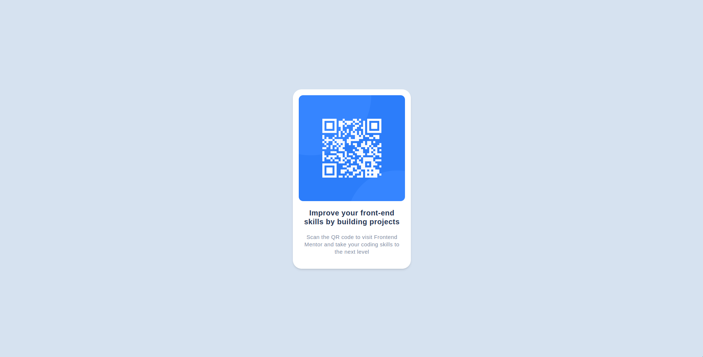

# Frontend Mentor - QR code component solution

This is a solution to the [QR code component challenge on Frontend Mentor](https://www.frontendmentor.io/challenges/qr-code-component-iux_sIO_H). Frontend Mentor challenges help you improve your coding skills by building realistic projects.

## Table of contents

- [Overview](#overview)
  - [Screenshot](#screenshot)
  - [Links](#links)
- [My process](#my-process)
  - [Built with](#built-with)
- [Author](#author)

**Note: Delete this note and update the table of contents based on what sections you keep.**

## Overview

### Screenshot

### Links

- Live Site URL: [Netlify](https://ncarf-qr-code.netlify.app/)

### Built with

- Semantic HTML5 markup
- TailwindCSS
- Flexbox

## Author

- Github - [github.com/ncarf](https://github.com/ncarf)
- Frontend Mentor - [@ncarf](https://www.frontendmentor.io/profile/ncarf)
